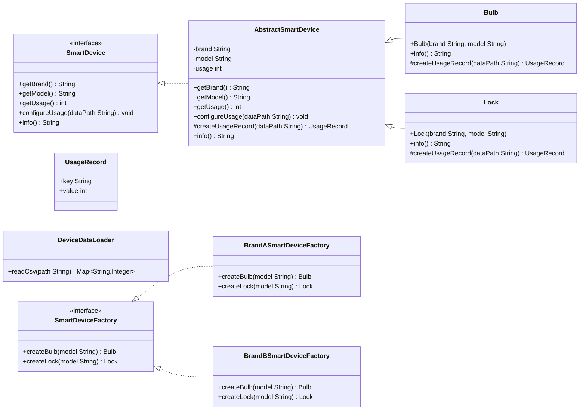

# Assignment 1 — Abstract Factory + Factory Method (Smart Home)

This repo implements the **Abstract Factory** pattern to create smart-home devices (Bulb, Lock) for multiple brands, and uses the **Factory Method** pattern to set device usage values **after** object creation by reading them from simple CSV “database” files.

> Matches the assignment’s scenario and deliverables (UML, Java implementation, test driver, README).

## Repo Structure

```
.
├── data/
│   ├── bulbs.csv        # Simulated DB: power (W) per bulb
│   └── locks.csv        # Simulated DB: battery usage (mAh/day) per lock
├── src/
│   ├── main/java/com/example/smarthome/
│   │   ├── AbstractSmartDevice.java
│   │   ├── BrandASmartDeviceFactory.java
│   │   ├── BrandBSmartDeviceFactory.java
│   │   ├── Bulb.java
│   │   ├── DeviceDataLoader.java
│   │   ├── Lock.java
│   │   ├── Main.java
│   │   ├── SmartDevice.java
│   │   └── UsageRecord.java
│   └── test/java/com/example/smarthome/
│       └── SmartHomeTest.java
└── pom.xml
```

## How the Patterns Are Used

- **Abstract Factory** (`SmartDeviceFactory`, `BrandASmartDeviceFactory`, `BrandBSmartDeviceFactory`): creates **families** of related products (Bulb, Lock) without tying client code to concrete classes.
- **Factory Method** (`AbstractSmartDevice#createUsageRecord`): after a `Bulb`/`Lock` is created by the factory, the device calls `configureUsage(...)`. That method delegates to the **factory method** `createUsageRecord(...)` implemented by concrete products to load and interpret the proper CSV and set the usage value.

## UML (Mermaid)

> GitHub renders Mermaid diagrams directly.



## Steps to Build & Run this asigmnet

### Prereqs
- Java 17+
- Maven 3.9+

### Compile & Test
```bash
mvn -q clean test
```

### Run demo
```bash
mvn -q -DskipTests exec:java -Dexec.args="data/bulbs.csv data/locks.csv"
```

**Expected output** (example):
```
== Demo ==
Bulb BrandA 100 - power=9W
Lock BrandB Secure-Pro - battery=35mAh/day
```

## Tests

- `SmartHomeTest` checks:
  - a Brand A bulb model `100` loads **9W** from `data/bulbs.csv`
  - a Brand B lock model `Secure-Pro` loads **35 mAh/day** from `data/locks.csv`

> You can add more rows to the CSVs to expand coverage.

## Notes

- The CSVs simulate an **external database**. In a real system, the factory method could read JSON, call a web service, or query an actual DB.
- Units are illustrative: **Bulb** uses *watts (W)*; **Lock** uses *mAh/day*.

---

### References (from assignment brief)

- Factory Method pattern — Wikipedia  
- Abstract Factory pattern — Wikipedia
```

